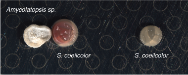

# Segmentation of MALDI-IMS Experiments of Bacterial Interspecies Interactions Using CardinalIMS

Unsupervised analysis of bacterial interspecies interactions using MALDI-IMS and the Cardinal package in R.
<!-- more -->
## 1. Introduction

The goal of this post is to showcase unsupervised analysis of MALDI-IMS experiments to discover chemical diversification during interspecies interactions of actinomycetota. Briefly, the setup involves growing patches of 


``` r
library(Cardinal)
library(dplyr)
library(knitr)
```
## 2. Growing cells and preparing samples

The following procedure was used to prepare samples for MALDI-IMS analysis:

- Media preparation: ISP2 medium was poured into 10 cm Petri dishes to a thickness of approximately 3 mm.
- Spore placement:
  - 0.5 µL of Amycolaptosis AA4 spore stock was spotted onto the agar.
  - 2 mm away, 0.5 µL of Streptomyces coelicolor spore stock was placed to allow interaction.
  - An additional 0.5 µL patch of S. coelicolor was placed 2 cm to the right of the interacting pair to serve as a non-interacting control.
- Incubation: Plates were incubated at 30 °C for 2 days.
- Sample preparation: A square of agar containing the interaction region was excised and placed onto a MALDI target plate.
- Drying: The agar samples on the target plate were dried at 30 °C for 5 minutes.
- Matrix application: Matrix was deposited via sublimation following Rita's method.



## 3. Unsupervised Segmentation

We collect the sample using MALDI-IMS module on a Thermo-Fisher orbitrap. 

First, we load .imzML files and plot a known ion. Even without preprocessing, we can detect known molecules by m/z—for example, amychelin, a siderophore produced by Amycolaptosis AA4.

However, raw ion images are noisy and make spatial interpretation difficult.


``` r
wt_aa4_path1 <- "msdata/040922_wt-aa4-2mm-1.imzml"
wt_aa4_1 <- readMSIData(wt_aa4_path1,resolution = 100, units="ppm",mass.range=c(150,1500))
image(wt_aa4_1, mz=761.3,tolerance=50, units="ppm",smooth="gaussian", enhance="histogram")
```

}}index.en_files/figure-html/unnamed-chunk-2-1.png" width="672" />

### 3.1 Pre-processing

We then normalize across pixels using total ion current (TIC) so that we can compare peaks across pixels. Then we can filter for high-quality peaks using peak processing: we use a subsample (30% of the spectra) of the dataset to create reference peaks and set a signal to noise ratio (SNR=3) to identify peaks, then we filter the lowest frequent filters (filterFeq=0.02).


``` r
wt_aa4_1 <- summarizeFeatures(wt_aa4_1, c(Mean="mean"))
wt_aa4_peaks <- wt_aa4_1 |>
  normalize(method="tic") |>
  peakProcess(method="diff",SNR=3, sampleSize=0.3,filterFreq=0.02)
```

### 3.2 Visualization

Let’s re-plot amychelin before and after processing.

``` r
amychelin_before<- image(wt_aa4_1, mz=761.3,smooth="gaussian", enhance="histogram")
amychelin_after <- image(wt_aa4_peaks, mz=761.3,smooth="gaussian", enhance="histogram")
matter::as_facets(list(amychelin_before, amychelin_after), nrow=2,
    labels=c("Before procesing", "After processing"))
```

}}index.en_files/figure-html/unnamed-chunk-4-1.png" width="672" />
We can see that we've sucesfully reduced noise in the image and we can now see spatially distinct regions where molecules are being produced.

### 3.3 Clustering and segmentation

We use `spatialShrunkenCentroids()` to perform unsupervised segmentation of spatially variable features.

**Key parameters:**

- `weights`: spatial weighting method ("gaussian" or "adaptive")
- `r`: neighborhood radius
- `k`: max number of clusters (some may be dropped)
- `s`: sparsity parameter; higher values result in fewer selected peaks


``` r
set.seed(1)
wt_aa4_ssc <- spatialShrunkenCentroids(wt_aa4_peaks,
    weights="gaussian", r=3, k=8, s=2^(1:4))
```

Let’s examine the results.

``` r
  kable(wt_aa4_ssc@elementMetadata,"pipe")
```


|             |  r|  k|  s|weights  | clusters| sparsity|       AIC|      BIC|
|:------------|--:|--:|--:|:--------|--------:|--------:|---------:|--------:|
|r=3,k=8,s=2  |  3|  8|  2|gaussian |        8|     0.53| 10220.679| 39651.66|
|r=3,k=8,s=4  |  3|  8|  4|gaussian |        8|     0.76|  6438.096| 24338.37|
|r=3,k=8,s=8  |  3|  8|  8|gaussian |        8|     0.92|  5084.403| 15003.83|
|r=3,k=8,s=16 |  3|  8| 16|gaussian |        8|     0.99|  6159.078| 12956.65|


We can visualize the results and pick one that has low sparcity and the correct number of clusters that is biologically relevant.


``` r
image(wt_aa4_ssc, i=1:4)
```

}}index.en_files/figure-html/unnamed-chunk-7-1.png" width="672" />

We choose the second result as it we can still see clearly each colony and the surrounding areas are distinct. 

``` r
wt_aa4_ssc1 <- wt_aa4_ssc[[2]]
image(wt_aa4_ssc1, type="class")
```

}}index.en_files/figure-html/unnamed-chunk-8-1.png" width="672" />

Here we can start making some interpretations of the five discrete regions in this model:
  1. *Amycolaptosis AA4* during interactions with *S. coelicolor*
  2. *S. coelicolor* during interactions with *Amycolaptosis AA4*
  3. *S. coelicolor* alone
  4.  Media (around *S. coelicolor*)
  5. Media (around *S. coelicolor* during interactions)
  6. Noise
  7. Media (around *Amycolaptosis AA4*)
  8. Noise
  
Let’s compare segments of interest 1, 2, and 3.


``` r
plot(wt_aa4_ssc1, type="centers", linewidth=2, select=c(1,2,3), superpose=FALSE, layout=c(1,3))
```

}}index.en_files/figure-html/unnamed-chunk-9-1.png" width="672" />

It is difficult to discern which peaks change based on ssc segmentation by looking at the whole spectra, so we must plot the t-statistics.

#### Plotting and interpretting t-statistics of the m/z values

The t-statistics compare segment-specific centroids to the global mean:

- Positive = enriched in that segment  
- Negative = depleted in that segment


``` r
plot(wt_aa4_ssc1, type="statistic", linewidth=2,
    select=c(1,2,3), superpose=FALSE, layout=c(1,3))
```

}}index.en_files/figure-html/unnamed-chunk-10-1.png" width="672" />

We can now see that there are peaks that are distinct in each region. In particular, if we compare segment 2 and segment 3. Segment 2 is the patch with *S. coelicolor* during the interaction and it has more peaks than when it's grown alone but also at a higher statistical difference.

Let’s visualize the top m/z features from each of the segments we are interested.


``` r
wt_aa4_ssc_top <- topFeatures(wt_aa4_ssc1)
     
image(wt_aa4_peaks, mz=c(head(subset(wt_aa4_ssc_top, class==1)$mz, n=1),
                         head(subset(wt_aa4_ssc_top, class==2)$mz, n=1),
                         head(subset(wt_aa4_ssc_top, class==3)$mz, n=1)), smooth="gaussian", enhance="histogram",layout=c(3,1))
```

}}index.en_files/figure-html/unnamed-chunk-11-1.png" width="672" />


Clearly we see peaks that are unique to *Amycolaptosis AA4* and peaks that are present in *S. coelicolor* during interactions or alone. More importantly we detect these peaks in an unsupervised manner.


